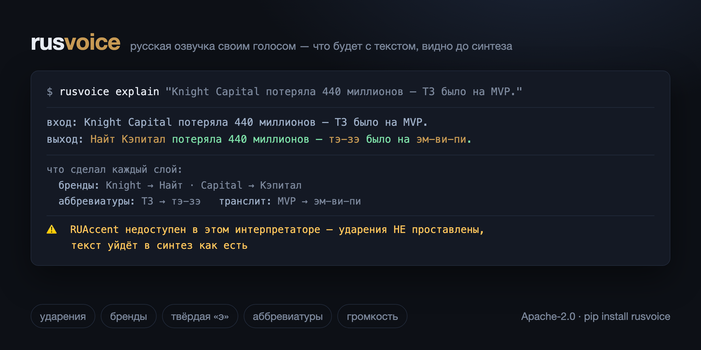

# rusvoice: русская озвучка своим голосом — ударения, бренды и аббревиатуры до синтеза

> CLI для русской озвучки клонированным голосом. Клонирование умеет открытый код; дефицитен
> **слой правки текста перед синтезом**: ударения (RUAccent), словарь брендов (Knight Capital
> → «Найт Кэпитал»), твёрдая «э» в заимствованиях, аббревиатуры по буквам (ТЗ → «тэ-зэ»),
> числа прописью. И возможность увидеть, что тракт сделает с репликой, ДО того как её
> услышишь: `explain`, `lint`, `doctor`, сверка речи после синтеза. Ядро — на голой
> стандартной библиотеке, ставится в любое чужое окружение.

> [English version](README.en.md)

[](https://pypi.org/project/rusvoice/)
[](https://pypi.org/project/rusvoice/)
[](LICENSE)
[](https://github.com/ilyautov/rusvoice/actions/workflows/ci.yml)
[](https://github.com/ilyautov/rusvoice/stargazers)

<p align="center">
  
</p>

**Быстрый старт** — ядру не нужна ни одна зависимость:

```bash
pip install rusvoice
rusvoice explain "Компания Knight Capital потеряла 440 миллионов — ТЗ было на MVP."
```

```
вход:  Компания Knight Capital потеряла 440 миллионов — ТЗ было на MVP.
выход: Компания Найт Кэпитал потеряла 440 миллионов — тэ-зэ было на эм-ви-пи.

что сделал каждый слой:
  бренды:
    Knight → Найт
    Capital → Кэпитал
  аббревиатуры:
    ТЗ → тэ-зэ
  транслит:
    MVP. → эм-ви-пи.

не применялось:
  · числа словами (нужен PRONOUNCE_NUMBERS=1)

⚠️
  RUAccent недоступен в /usr/bin/python3 — ударения НЕ проставлены,
  текст уйдёт в синтез как есть
```

Предупреждение внизу и есть смысл всей затеи: без него окружение **промолчало бы**, озвучка
вышла бы без ударений, а списали бы это на модель. Код возврата при таком выводе — `1`:
`explain` пригоден как проверка в скрипте, а не только для чтения глазами.

Дальше: [синтез своим голосом](#say--весь-рецепт-одной-командой) ·
[свой голос один раз](#voice--свой-голос-один-раз-и-навсегда) ·
[словари](#dict--словари-произношения) · [что рядом](#что-рядом-и-чем-это-отличается) ·
[установка с экстрами](#установка) · [лицензии](#лицензии)

---

Клонировать голос сегодня умеет открытый код: [F5-TTS](https://github.com/SWivid/F5-TTS)
плюс русский чекпойнт. Дефицитно другое — то, что происходит с текстом ПЕРЕД синтезом
(ударения, бренды, твёрдая «э», аббревиатуры, транслит) и возможность понять, почему
получилось не так, как хотелось.

Без этого слоя каждый дефект выглядит одинаково: «модель так читает». На деле за одним и
тем же симптомом стоят разные причины, и все они молчаливые:

| Слышно | На самом деле |
|---|---|
| «Книгхт Капитал» вместо Knight Capital | слова нет в словаре брендов → побуквенный транслит |
| «модель мямлит» | транскрипт эталона не про это аудио → галлюцинация префикса, +13% WER |
| правка словаря «не сработала» | RUAccent нет в этом интерпретаторе → текст ушёл без ударений |
| «нейрослоп» на одном слове | метка «+» на односложном → F5 отыгрывает её как нажим |
| «тихо» после нормализации | `loudnorm` вернул −15.3 при rc=0 и это сочли успехом |

Все команды здесь — про то, чтобы каждая строка этой таблицы обнаруживалась ДО прослушивания.

## Что рядом и чем это отличается

Соседи есть, и притворяться, что их нет, глупо — лучше сразу сказать, когда нужны они,
а когда мы.

- **[RUAccent](https://github.com/Den4ikAI/ruaccent)** — ударения. Мы его не заменяем,
  а зовём внутри: он размечает 98.3% многосложных слов, и переписывать это незачем.
- **[RUNorm](https://github.com/Den4ikAI/runorm)** — числа прописью, аббревиатуры,
  кириллизация, акронимы. Тот же список задач, что у нашего слоя произношения, но
  нейросетью: три модели на 95M–860M параметров, то есть torch ради нормализации текста.
  Ударений не ставит, синтеза не делает.
- **[russian_tts_normalization](https://github.com/shigabeev/russian_tts_normalization)**,
  **[ru-tts-norm](https://github.com/dsnam/ru-tts-norm)**,
  **[saarus72/text_normalization](https://github.com/saarus72/text_normalization)** — того
  же класса: преобразователи текста, которые кладут внутрь своей TTS-системы.

Все они — **нормализаторы**: на входе текст, на выходе текст. Здесь другое: обвязка вокруг
всей озвучки — эталон, синтез, громкость, — и её отличительная черта не список правил, а
**прослеживаемость**. Посмотреть, что тракт сделает с репликой, до синтеза (`explain`);
найти в сценарии реплики, которые прозвучат не так (`lint`); сверить, что реально
прозвучало (`say` → проверка речи). Ни у одного соседа этого нет, потому что библиотеке
это и не нужно — а инструменту без этого грош цена: дефект озвучки иначе обнаруживается
только ушами и только после рендера.

Ядро (`explain`, `lint`, `dict`) при этом стоит на голой стандартной библиотеке и ставится
в любое чужое окружение — в том числе туда, где своя версия торча и лишней не будет.

## Установка

```bash
pip install rusvoice                    # ядро: explain / lint / dict / doctor
pip install "rusvoice[accent,ui]"       # + ударения (RUAccent) и экран
pip install "rusvoice[voice,accent]"    # + собственно синтез (F5)
rusvoice --help
```

Свежий `main` — `pip install "git+https://github.com/ilyautov/rusvoice"`; из клона —
`pip install -e ".[dev]"`.

Ядро — `explain`, `lint`, `dict` — стоит на голой стандартной библиотеке и едет куда угодно.
Это не аскеза: команда, которая объясняет, что тракт сделает с текстом, обязана ставиться
там же, где стоит сам тракт, а он живёт в чужих окружениях с чужими версиями торча.

Экстра | Что включает
---|---
`accent` | RUAccent — ударения. Без него слой не падает, он молча отдаёт текст как есть
`numbers` | `num2words` для `PRONOUNCE_NUMBERS=1`
`ui` | `rusvoice ui` — живой просмотр в браузере
`ref` | `ref grab`/`ref windows` — пословные тайминги и замер окон
`voice` | `say` — сам синтез: F5-TTS. ⚠️ Тянет torch, веса качаются при первом запуске (~2.5 ГБ)

**Движок, из которого пакет вырос, ему не нужен ни для чего — включая синтез.** Рецепт
клона живёт здесь же, в [`rusvoice/clone.py`](rusvoice/clone.py). Так было не всегда: он лежал в
`pipeline/voiceclone.py`, и `say` — единственная команда, ради которой ставят остальные, —
требовала рядом весь видеотракт. Самостоятельная установка умела всё, кроме озвучки.

Когда движок рядом, три вещи берутся у него: потолок лимитера (константа мирится тестом),
его static-ffmpeg и его whisperx с кэшем. Не потому, что своих нет — своих хватает
(`FFMPEG_BIN` или PATH; libass пакету не нужен, субтитров он не рисует; ASR из
`faster-whisper`), — а потому, что иначе поведение внутри репозитория поехало бы.

⚠️ **Запускать тем же интерпретатором, каким пойдёт синтез.** RUAccent и F5 обычно стоят
не в том же окружении, что остальной код, и `rusvoice doctor` это честно покажет — в этом
половина его смысла.

## Команды

### `explain` — что тракт сделает с репликой

```
$ python3 -m rusvoice explain "Claude Code на подписке MAX: лендинг за 5x дешевле."
вход:  Claude Code на подписке MAX: лендинг за 5x дешевле.
выход: Клод Код на подп+иске Макс: л+эндинг за пять раз деш+евле.

что сделал каждый слой:
  бренды:      Claude → Клод · Code → Код · MAX: → Макс:
  множители:   5x → пять раз
  твёрдая э:   лендинг → лэндинг
  ударения:    подписке → подп+иске · лэндинг → л+эндинг · дешевле → деш+евле
```

Ценность не в «текст изменился», а в том, **кто** его изменил: правка словаря, которая
«не доехала», отличается от правки, которую перекрыл другой слой.

Флаги: `--json`, `--lang`, `--no-accent` (путь edge-голоса: он «+» не уважает).
Аргументом можно дать текст, путь к файлу или `-` для stdin.

### `lint` — найти реплики, которые прозвучат не так

```
$ python3 -m rusvoice lint scenario.json
#3 · как это устроено
  Knight Capital потеряла 440 миллионов за 45 минут.
  ✗ [транслит] «Knight» → «Книгхт» — слова нет в словаре брендов
      → rusvoice dict add brands Knight <как читать>
  ✗ [цифры] «440» уйдёт в синтез цифрами — F5 их путает
```

Ловит и то, что «нет метки» не поймает: **омографы, где метка стоит, но не та**.

```
  · [омограф] «потом» → «п+отом»: выбрано редкое чтение — творительный от «пот»
      → если имелось в виду обычное, поставь метку: пот+ом
```

Замер по корпусу движка (456 сценариев, 6791 реплика): RUAccent размечает 98.3%
многосложных слов, и пропущенных меток проблемы нет — а вот выбор он путает. «Потом
становится легко» уходило в синтез как «по́том». Словарём это не лечится: одно слово в
соседних репликах читается по-разному («за́мок на горе» и «замо́к щёлкнул в двери»), и
глобальная замена сломала бы половину. Отвечает автор — меткой прямо в тексте.

Срабатывает на 0.4% реплик: в таблице только пары, где одно чтение подавляюще частотнее.
«уже́» встретилось 273 раза, «со́рок» — 133, и оба раза акцентизатор прав; предупреждать
там значило бы приучить пролистывать вывод.

Читает сценарий (`scenes[].vo`), текстовый файл построчно или сам аргумент.
**Дефект** и **риск** разведены нарочно: код выхода ненулевой только на дефектах.
Линт, падающий на рисках, отключают в первый же день — а вместе с ним перестают видеть
и «Книгхт».

### `doctor` — можно ли верить этому окружению

Каждая проверка стоит на конкретном уже случившемся провале: RUAccent, `PYTHONHASHSEED`
(дочерний процесс F5 падает, но на одном батче звук всё равно возвращается — поэтому в
логах это выглядит безобидно), ffmpeg, эталон и его транскрипт, размеры словарей, версия
правил. Ничего не чинит и не мутирует: ставит диагноз.

### `dict` — словари произношения

```bash
python3 -m rusvoice dict list hard-e --check      # что в словаре живого
python3 -m rusvoice dict add brands Netlify Нетлифай
python3 -m rusvoice dict hear brands Netlify      # услышать запись, а не прочитать
python3 -m rusvoice dict bump                     # инвалидировать аудио-кэш
```

`add` пишет только после проверки: запись применяется к пробнику на копии таблицы, и если
слой выдал не то — файл не трогается. Отказ по умолчанию на перезаписи и на основе,
задевающей заведомо мягкие слова (сплошного правила «е→э» нет — «лес», «дело», «текст»
читаются мягко, поэтому это словарь, а не правило).

`add` проверяет **строку**: что слой на «OpenAI» даёт «Оупен Эй Ай». Что из этой строки
сделает F5, не знает никто — для этого `hear`: он озвучивает пробник фразой (на одиночном
слове модель ведёт себя иначе, чем в потоке речи). Отдельной командой, потому что синтез на
M1 стоит десятки секунд, а записей за заход бывает тридцать.

⚠️ Правка словаря сама по себе не инвалидирует аудио-кэш движка — отсюда `bump`.

Версия правил живёт рядом с самими правилами (`rusvoice/pronounce.py`,
`rusvoice/accentize.py`), и движок её оттуда читает. Копий было три, и правило звучало
«поменял поведение — подними номер руками во всех местах»; копия, которую надо помнить,
однажды не поднимается — так один из потребителей завёл версию ударений в ключе кэша, а
второй нет, и футаж молча выродился в один клип на сцену.

### `voice` — свой голос один раз и навсегда

```bash
rusvoice voice add запись.mp4 --name ilya   # видео, аудио или готовый эталон
rusvoice voice set tempo 1.12               # настройка ГОЛОСА, не окружения
rusvoice say "реплика" --out o.wav          # --ref больше не нужен
```

До этой команды `say` без `--ref` брала зашитый путь к эталону внутри репозитория: рядом с
движком работало, в самостоятельной установке — «эталона нет», без единого слова о том, где
его взять. Хотя взять пакет умеет давно: `ref grab` достаёт годный эталон из любого видео.
Дыра была не в возможностях, а в дефолте.

`voice add` выбирает путь сам и говорит, какой. Готовый эталон (есть `.txt` рядом, длина
4–25 с) копируется как есть: гонять ASR по уже разобранному — минута работы ради того, чтобы
заменить выверенный транскрипт свежей ослышкой. Всё остальное проходит `ref grab`.
Копируем к себе, а не ссылаемся: эталон, который однажды переименуют, — это молчаливо
сломанный голос.

Настройки (`tempo`, `outro`) живут **у голоса**, потому что они и есть его свойства: темп
1.12 у одного человека и 1.0 у другого. Глобальный ключ пришлось бы переставлять при каждой
смене голоса — и однажды не переставить. `say` берёт их только там, где вы промолчали:
явный `--tempo` их перебивает, и команда пишет в шагах, откуда взяла значение.

⚠️ `nfe` (шагов диффузии F5) сюда не входит: единственный канал до него — env/config, а
подпись провайдера параметра не пропускает. Механизм, который работает не везде и не
говорит об этом, хуже отсутствующего.

⚠️ `voice remove` убирает **из реестра**, файл остаётся. Правка настройки и потеря
материала — разные вещи.

⚠️ `clone_synth` (вход рендера в движке) реестр голосов **не смотрит** — он берёт эталон из
своего конфига. Иначе `voice use` молча переозвучил бы чужим голосом следующий ролик.

⚠️ **Пакет не знает ничьего голоса, и это не мелочь.** Раньше в коде стояли путь к эталону
конкретного человека и его дословный транскрипт как дефолт. Пара «эталон + точный
транскрипт» — это и есть ключ клонирования голоса, и в открытом пакете ей не место;
никакого дефолта она при этом не давала — чужой голос не подходит никому. Свой эталон
приносит пользователь, эталон движка живёт в конфиге движка.

### `ref` — эталон голоса из чего угодно

```bash
python3 -m rusvoice ref grab видео.mp4 --out ref.wav   # одной командой: голос из видео
python3 -m rusvoice ref check --ref ref.wav
python3 -m rusvoice ref windows источник.mp4           # окна-кандидаты по паузам
python3 -m rusvoice ref cut источник.mp4 ref.wav --start 4.4 --end 14.2
```

`grab` достаёт дорожку, снимает пословные тайминги и **измеряет** окна-кандидаты, а не
выбирает их на глаз по волне. На глаз не видно двух вещей, которые потом слышны в клоне:
длинной паузы внутри окна (звучит как склейка) и высокого фона между словами (клон
наследует шум эталона вместе с голосом). Фон меряется именно в промежутках между словами —
усреднение по всему окну перевесила бы речь, и грязная запись получила бы хорошую оценку.

```
речь: 42 слов в источнике
✓ ref.wav — 9.91 с, 27 слов
  окно 0.081–9.987 с · пауза 0.1 с · фон -20.3 dBFS · пик -3.0 dBFS
что ещё подошло бы:
    2.88– 13.17 (10.29 с)  пауза 0.10 · фон -20 · пик -3
```

`cut` режет окно **по границам слов** (границы снимаются с ASR-таймингов) и кладёт рядом
транскрипт, собранный из тех же слов, что попали в окно: дословность по построению, а не
по аккуратности. Полслова в эталоне — это уже не дословный транскрипт, каким бы точным
ни был `.txt`.

### `loud` — громкость

```bash
python3 -m rusvoice loud голос.wav                 # замерить и рассудить
python3 -m rusvoice loud голос.wav --out norm.wav  # довести до −14 LUFS
```

Успех объявляется **по замеру выхода**, а не по коду возврата ffmpeg. Недобор объясняется
арифметикой: «нужно было +4.0 дБ, дошло +2.7; вход: среднее −18.0 при пике 0.0 (размах
18.0 дБ) — лимитер упирается раньше громкости».

### `say` — весь рецепт одной командой

```bash
python3 -m rusvoice say "реплика" --out out.wav --ref голос.wav
```

F5-клон → темп (`--tempo`) → хвост (`--outro`) → громкость → **сверка речи**. Печатает, что
реально сделано: текст по слоям, шаги вместе с пропущенными, замер выхода.

Последний шаг — единственный, который смотрит на результат, а не на замысел. Все прочие
проверки стоят до синтеза и ловят то, что мы предусмотрели; модель может уронить слово уже
после них. В движке так и было: edge отдал 2.9 с на текст в 53 слова, в треке оказалось два
слова, а проверкой был размер файла — обрезок весил 17 КБ и прошёл дальше.

Судим по доле покрытия, не по совпадению слов: ASR ошибается на каждом десятом слове, и
дословная сверка давала бы ложную тревогу на каждой реплике с брендом. Порог не назначен, а
взят с калибровки движка (здоровые сцены 0.955–0.983, обрезанная 0.038). На тексте короче
12 слов не судим вовсе. Отключается `--no-verify`.

Хвост стоит отдельным шагом, потому что `clone_synth` кладёт 0.18 с — это паддинг **клипа**,
рассчитанный на стык со следующей сценой. Для отдельного файла те же 0.18 с слышны как
захлопнутая дверь: это конец всего текста, а не стык. По умолчанию 0.5 с; `--outro 0.18`
возвращает клиповый хвост.

⚠️ Энхансера (`resemble-enhance`) в рецепте нет. Он там стоял, пока клон снимали с
неидеального эталона; на нынешнем выходе F5 он звук портит и на обычной настройке, и на
самой мягкой. Ручка, заведомо делающая хуже, — ровно та молчаливая ловушка, против которой
весь пакет, поэтому её убрали, а не оставили «на всякий случай».

### `ui` — то же самое в браузере

```bash
python3 -m rusvoice ui        # http://127.0.0.1:8765
```

Живой `explain` по мере набора, словари с пометкой живая/мёртвая, доктор. Своей логики
нет — те же функции пакета, поэтому разъехаться с CLI нечему.

⚠️ Слушает `127.0.0.1` не для красоты: ручки пишут в словари и запускают синтез.

## Лицензии

Код пакета — **[Apache-2.0](LICENSE)**.

Выбор объясняется одним доводом. Главная ценность здесь не клонирование голоса — F5-TTS и
так открыт, — а **слой правки текста**, и его смысл в том, чтобы им пользовались, в том
числе внутри чужих синтезаторов. Копилефт (AGPL) закрыл бы ровно это распространение,
а взамен дал бы защиту от закрытого форка CLI — угрозы почти теоретической, потому что
инструменты запускают, а не встраивают.

⚠️ Отдельно, потому что это часто путают: **AGPL не запрещает коммерцию**. Она требует
отдавать исходники тем, кому предоставил доступ по сети, — и только. Лицензии,
запрещающей заработок, среди открытых нет вовсе (у весов F5 такая есть — CC BY-NC, и это
не опен-сорс). Там, где сетевая оговорка действительно работает — у бота, который будет
жить отдельным репозиторием, — берётся AGPL.

Веса, на которых пакет работает, свои условия несут отдельно:

- **F5-TTS** — код MIT;
- ⚠️ **русский чекпойнт `Misha24-10/F5-TTS_RUSSIAN` — CC BY-NC 4.0, некоммерческое использование**;
- **RUAccent** — Apache-2.0.

Веса пакет не тянет и не распространяет — скачивает по требованию, и условия остаются на
том, кто скачал.

---

[Изменения](CHANGELOG.md) · [Как помочь](CONTRIBUTING.md) · [Безопасность](SECURITY.md) ·
[English](README.en.md)

Самый полезный вклад — **слово, которое читается неверно**: словарь растёт только от живых
ошибок, придумать их за столом нельзя.
